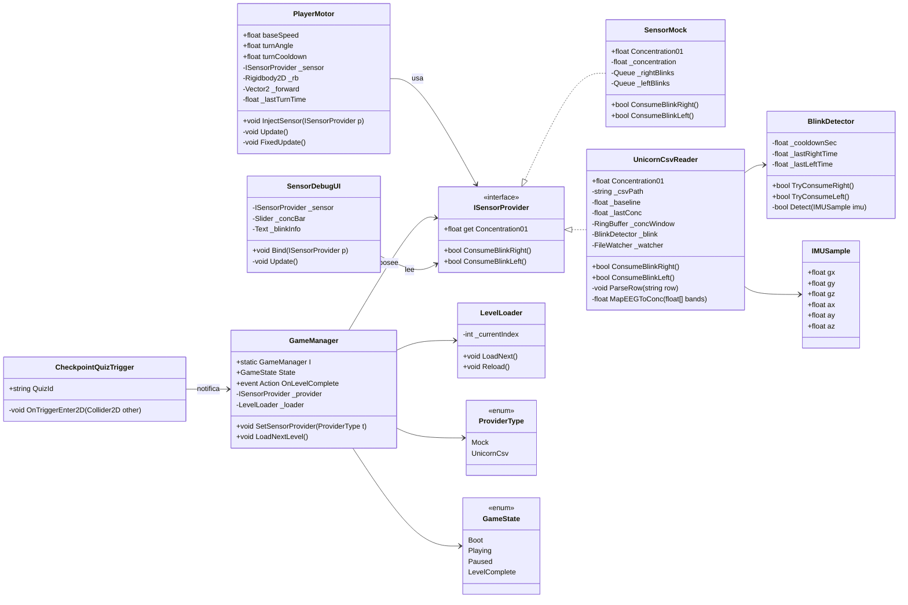

# Laberinto
Versión de Unity: <anota aquí la versión exacta del Hub>
## Abrir
1) git clone <URL>
2) Unity Hub → Open → carpeta clonada
3) Abrir `Assets/Scenes/Main.unity`
## Ramas
- main (estable)
- dev (integración)
- feature/<area>-<nombre>

## Instalación (Python)

Requisitos: Python 3.10–3.12

1) Crear ambiente virtual
```bash
cd python
python -m venv .venv
# Windows:
.\.venv\Scripts\activate
# macOS/Linux:
source .venv/bin/activate
```


